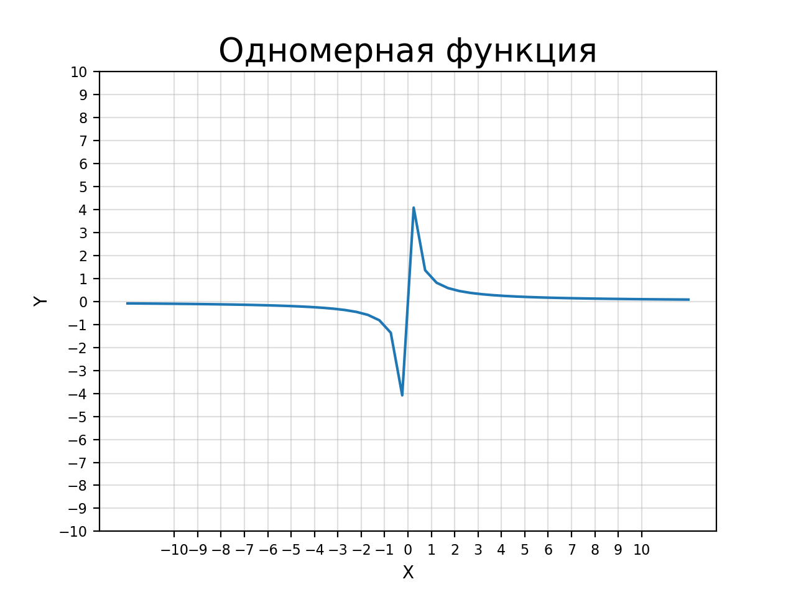
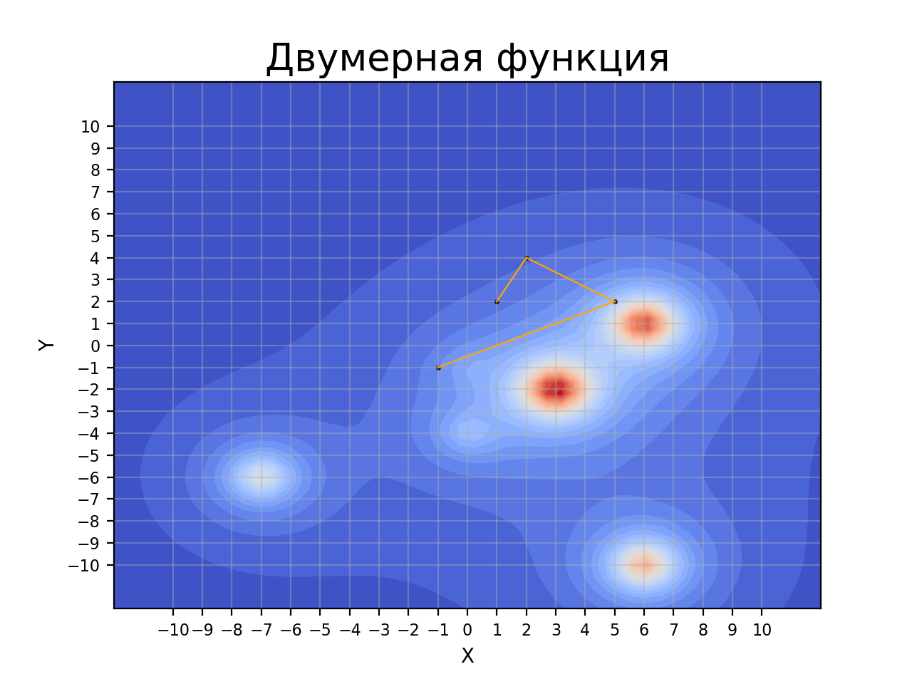
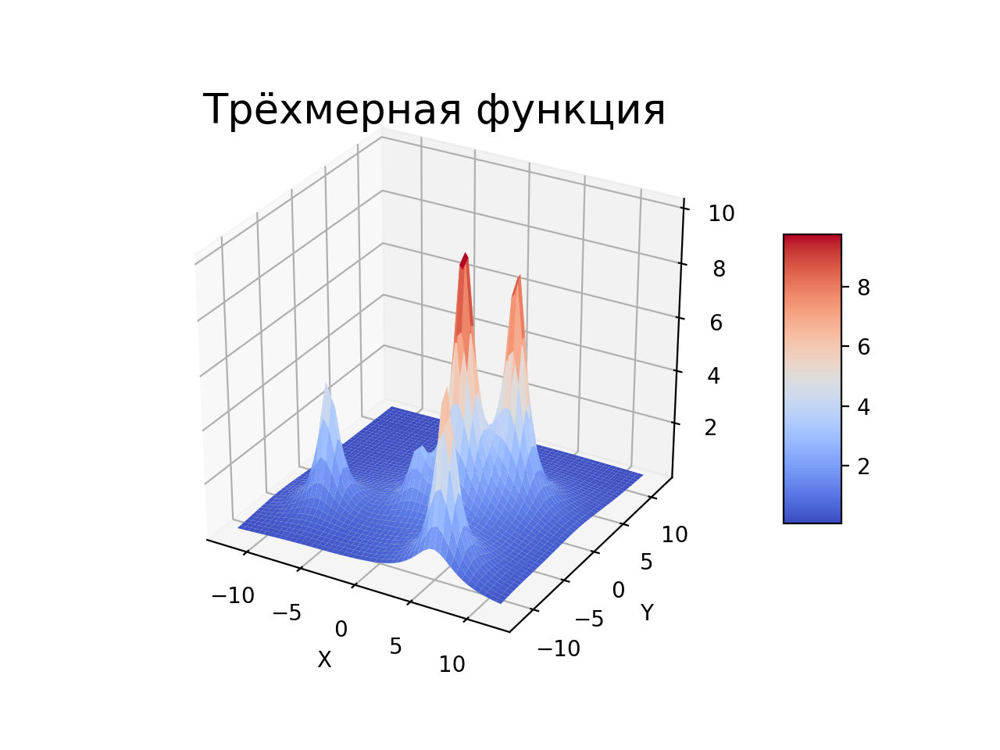
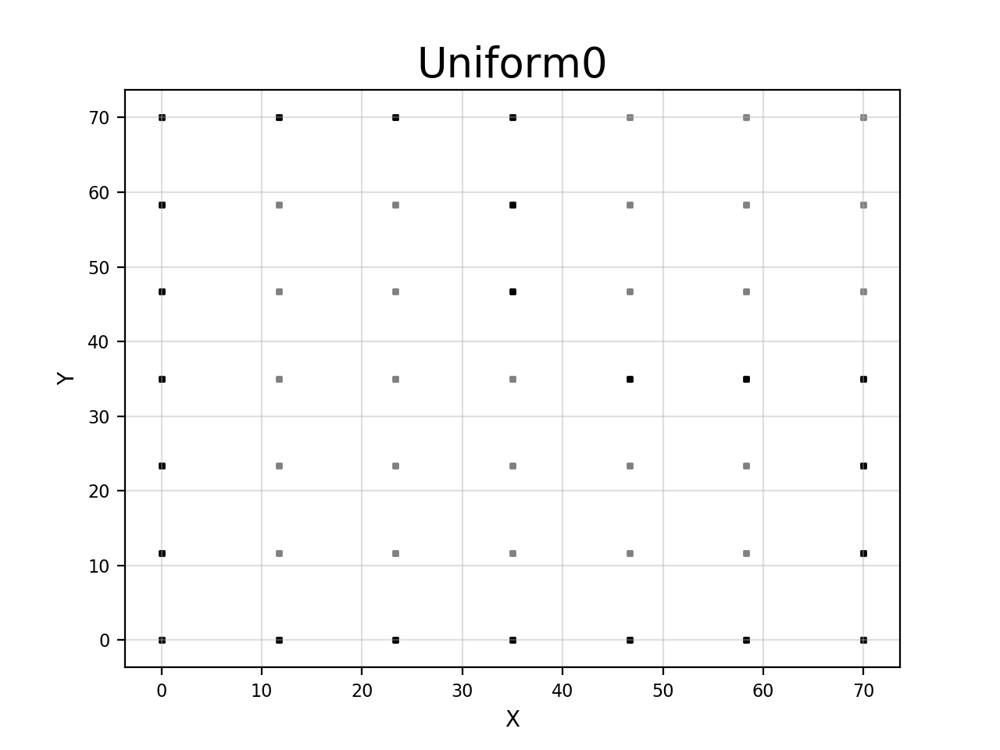
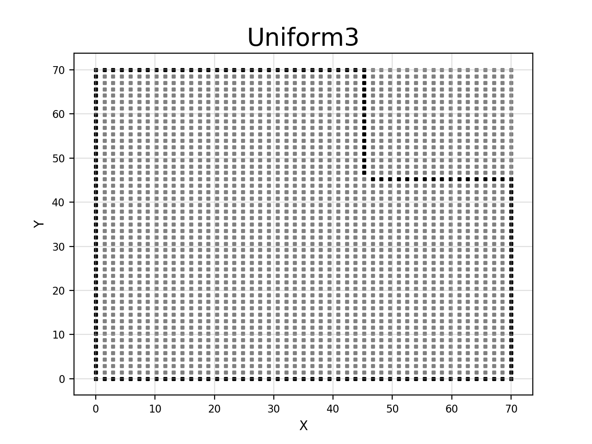
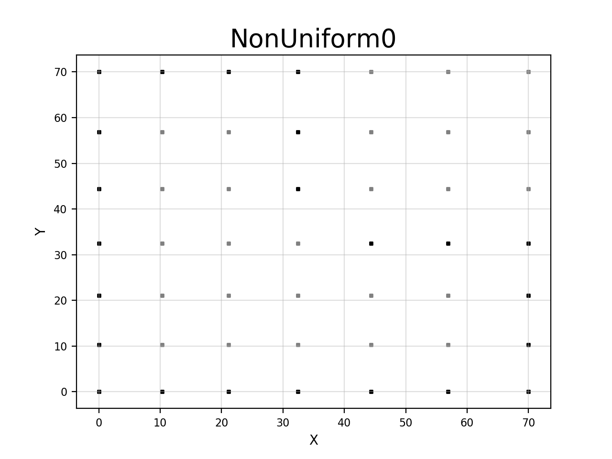
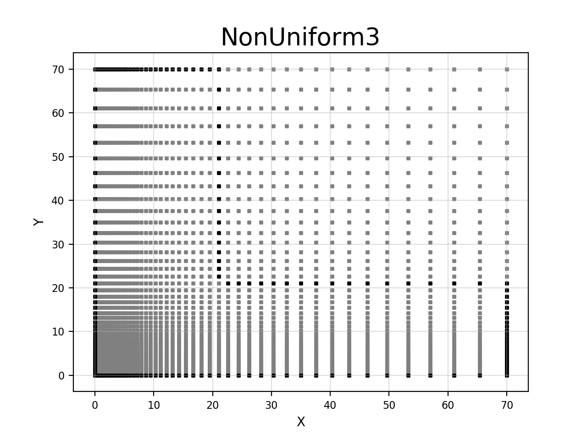

# Простая визулизация функций и сходимости методов

Файлы:

1. Отрисовка одномерной функции:
draw1D.py

2. Отрисовка проекции двумерной функции и сходимости метода:
draw2D.py

3. Отрисовка двумерной функции в 3D:
draw3D.py

4. Отрисовка прямоугольных сеток для МКЭ:
draw_grids.py
 | 
 | 